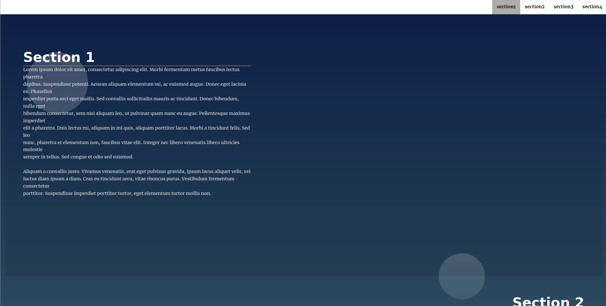
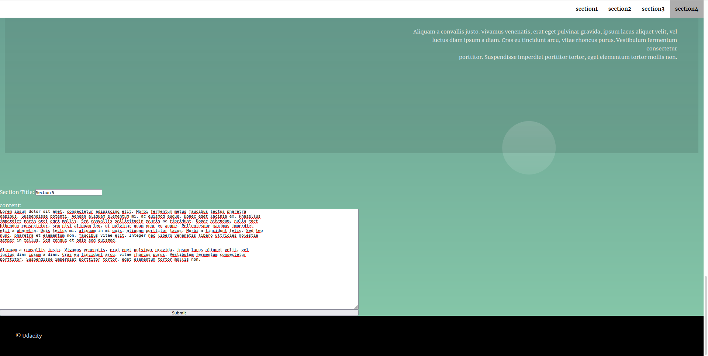
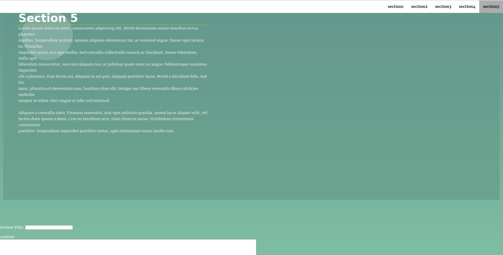
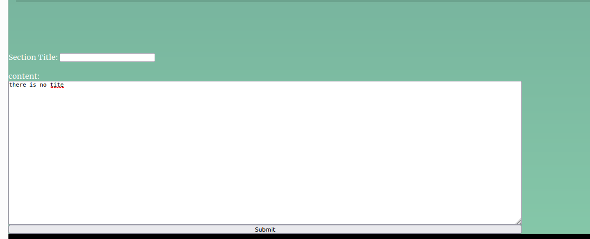
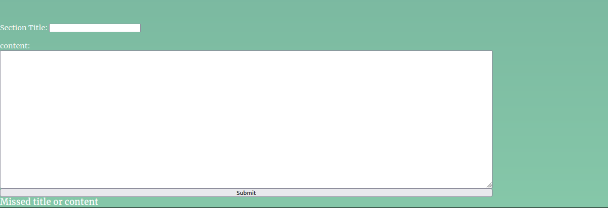

# Landing Page Project

## Table of Contents

* [Instructions](#instructions)
* [project description](#project_description)
* [dependencies](#dependencies)

## Instructions

The starter project has some HTML and CSS styling to display a static version of the Landing Page project. You'll need to convert this project from a static project to an interactive one. This will require modifying the HTML and CSS files, but primarily the JavaScript file.

To get started, open `js/app.js` and start building out the app's functionality

For specific, detailed instructions, look at the project instructions in the Udacity Classroom.

## project_description

This project requires  to build a multi-section landing page, with a dynamically updating navigational menu based on the amount of content that is added to the page.

the starter project  [link](https://github.com/udacity/fend/tree/refresh-2019) 

By default the page contains 4 sections 

you can move between by scrolling or clicking on the section number from the top Nav

you can add much section you need from the bottom window and when you submit the nav bar also will be automatically updated

if you missed the title or the content, no section will be added and erro message will apper.
 

## dependencies
the project is built on:
* html
* css
* js

